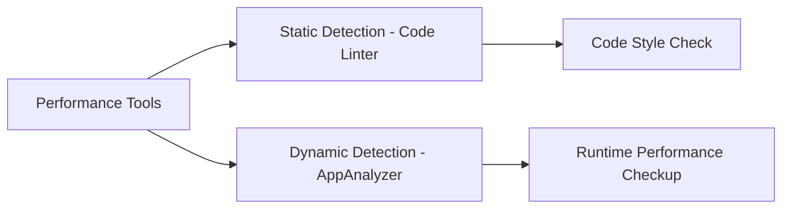

### HarmonyOS Performance Detection Treasure Tools Unveiled! Development Battle Pitfall Prevention Guide  

Hello everyone! I'm Xiaoming, an explorer on the HarmonyOS development path. Today, I've unearthed an official hidden collection of performance tuning artifacts—it's like discovering a new continent! Many case documents are deeply hidden but extremely practical in real development. Without further ado, let's dive into the干货!  


### 🔥 I. Tuning Toolkit  
The official categorizes performance tools into two factions: static detection (pitfall prevention in advance) and dynamic detection (bug hunting at runtime):  



### ⚡ II. Static Pitfall Prevention: Code Linter  
**Core function**: Real-time detection of potential performance issues while coding, like having an expert watching over you!  

#### 📌 Battle Case 1: Sparse Array Trap  
**Problem code** (official rule @performance/sparse-array-check):  
```typescript  
// Create a sparse array (with holes in between)  
let arr = new Array(100);  
arr[99] = 1; // Only the last element is assigned  
```  
**Risk**: HarmonyOS's ArkTS engine handles sparse arrays extremely inefficiently!  
**Optimization plan**: Switch to a contiguous array  
```typescript  
// Correct approach: Pre-fill with default values  
let arr = new Array(100).fill(0);  
arr[99] = 1;  
```  

#### 📌 Battle Case 2:疯狂Updating State Variables in Loops  
**Problem code** (rule @performance/hp-arkui-no-state-var-access-in-loop):  
```typescript  
@State count: number = 0;  

ForEach(this.dataList, item => {  
  this.count += item.value; // Fatal operation! Triggers UI redraw on each loop  
})  
```  
**Risk**: Frequent updates to @State variables in loops cause UI to lag like a PPT!  
**Optimization plan**: Use a temporary variable instead  
```typescript  
let tmpCount = 0;  
ForEach(this.dataList, item => {  
  tmpCount += item.value; // Accumulate first  
})  
this.count = tmpCount; // Update all at once in the end  
```  


### 🔍 III. Dynamic Bug Hunting: AppAnalyzer  
**Core function**: Conduct a "full-body checkup" on the app and generate a performance diagnosis report with one click!  

**Usage steps** (with pitfall prevention guide):  
1. Open the tool: DevEco Studio > Tools > AppAnalyzer  
2. Select the module: Must sign and package in advance (newbies often forget this step!)  
3. Start the checkup: Check the Benchmark performance package → Click Start  
4. Manual operation: Slide the page/click buttons as prompted (click Stop when the countdown ends)  

#### 🔥 Report key interpretation:  
● Red-yellow warning items: Such as detected sliding frame drops or cold start timeouts  
● Intelligent jumps:  
  ○ Optimization Suggestion: View official optimization plans  
  ○ Code Linter: Automatically locate problem code files  
  ○ Profiler: Import trace logs for in-depth analysis  


### 🚀 IV. High-Frequency Performance Rules Quick Reference Table  

| Problem Scenario       | Rule ID                                   | Must-Fix Level |  
|------------------------|-------------------------------------------|----------------|  
| Sliding Lag            | @performance/use-row-column-to-replace-flex | ⚠️ Warning     |  
| Animation Frame Drops  | @performance/combine-same-arg-animateto    | ⚠️ Warning     |  
| Slow Cold Start        | @performance/start-window-icon-check       | 💡 Suggestion  |  
| Memory Leak Risk       | @performance/remove-unchanged-state-var    | 💡 Suggestion  |  

#### 💡 Case: @performance/use-row-column-to-replace-flex  
Is Flex layout nested too deeply? Official confirmation:  
```typescript  
// Not recommended  
Flex({ direction: FlexDirection.Column }) { ... }  

// Recommended! Performance improved by 20%+  
Column() { ... }  
```  


### 💎 V. Bonus: Golden Rules for Performance Optimization  
1. **State variables**: @State changes trigger UI updates—keep operations lightweight.  
2. **Component reuse**: LazyForEach must set cacheCount (official rule ID: hp-arkui-set-cache-count-for-lazyforeach-grid).  
3. **Resource loading**: Use asynchronous for large images, and offload network requests to taskpool (rule ID: hp-arkui-use-taskpool-for-web-request).  

```typescript  
// Network request optimization example  
import taskpool from '@ohos.taskpool';  

@Concurrent  
async function fetchData() {  
  return await http.get('https://api.example.com/data');  
}  

// Offload to thread pool for execution  
taskpool.execute(fetchData).then(result => {  
  // Update UI  
});  
```  


### 🌈 Conclusion  
The HarmonyOS performance detection tools unearthed this time are like "clairvoyance" for apps. Especially the real-time tips from Code Linter, which have saved me countless all-nighters! Recommendations for development:  
● Write code on the left → Run Code Linter on the right.  
● Before each nightly commit → Run AppAnalyzer for a checkup.  

Finally, a shoutout: Encountered performance mysteries? Head to the community and shout out!  

If you find this useful, hit the like button ❤️—see you in the comments!
